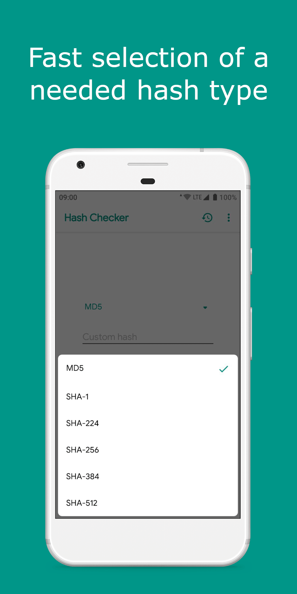

## About application

Fast and simple application for generating and comparison hashes from files or text.

## Supporting algorithms

| Name | Since version | Status |
| --- | --- | --- |
| [MD5](https://en.wikipedia.org/wiki/MD5) | 1.0.0 | `Supporting` |
| [SHA-1](https://en.wikipedia.org/wiki/SHA-1) | 1.0.0 | `Supporting` |
| [SHA-224](https://en.wikipedia.org/wiki/SHA-2) | 1.4.0 | `Supporting` |
| [SHA-256](https://en.wikipedia.org/wiki/SHA-2) | 1.0.0 | `Supporting` |
| [SHA-384](https://en.wikipedia.org/wiki/SHA-2) | 1.4.0 | `Supporting` |
| [SHA-512](https://en.wikipedia.org/wiki/SHA-2) | 1.0.0 | `Supporting` |
| [CRC32](https://en.wikipedia.org/wiki/Cyclic_redundancy_check) | 2.9.0 | `Supporting` |

## Screenshots

 

  
  
  
  
  

## Videos

- [YouTube](https://www.youtube.com/watch?v=Q7Otn971kJk&list=PLOIwDRWd_SDdBz2aiVtMocFunaXaKSPMx)

## Downloads

- [Google Play](https://play.google.com/store/apps/details?id=com.smlnskgmail.jaman.hashchecker)
- [GitHub](https://github.com/fartem/hash-checker/releases)

## Privacy Policy

- [fartem.github.io/hash-checker-privacy-policy.io](https://fartem.github.io/hash-checker-privacy-policy.io/)

## Contributors

- [@fartem](https://github.com/fartem) as Artem Fomchenkov