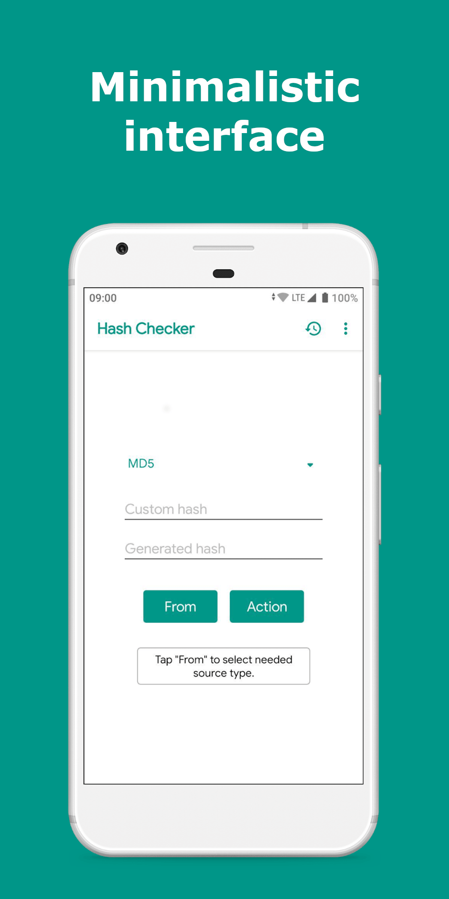
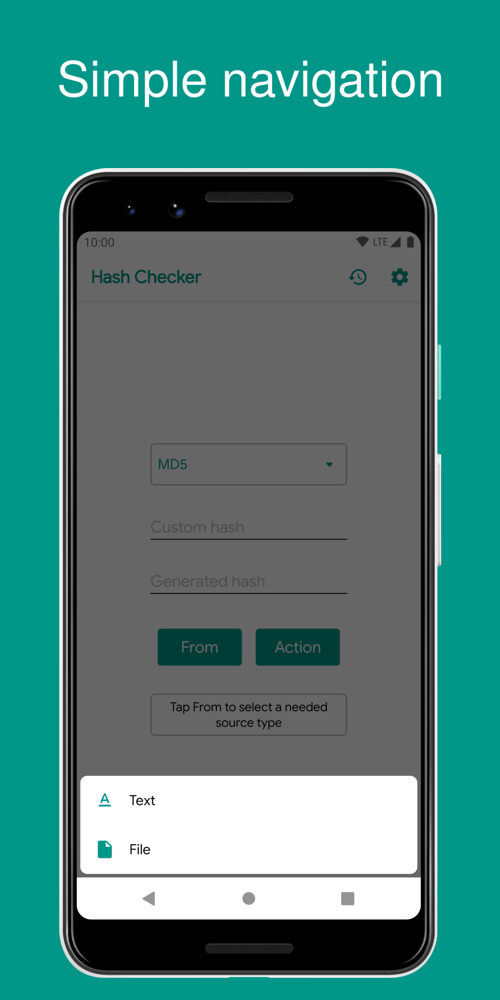
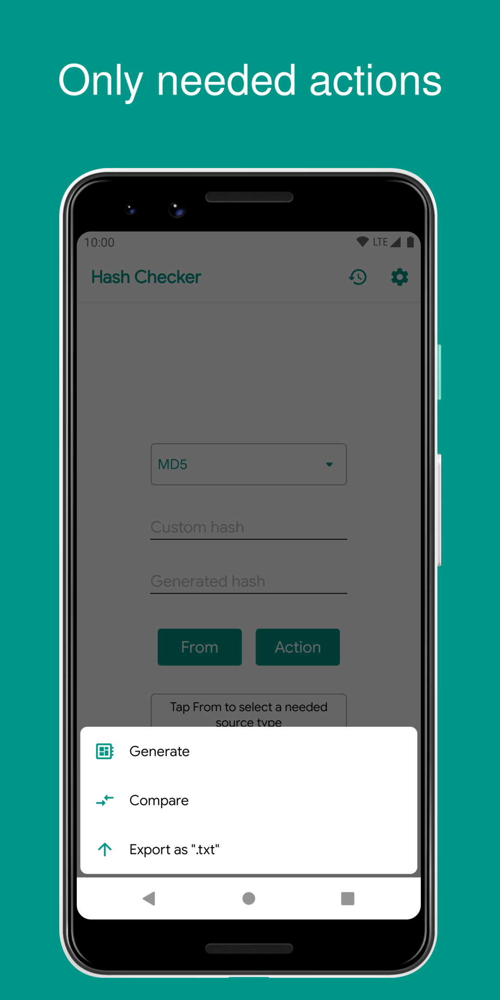
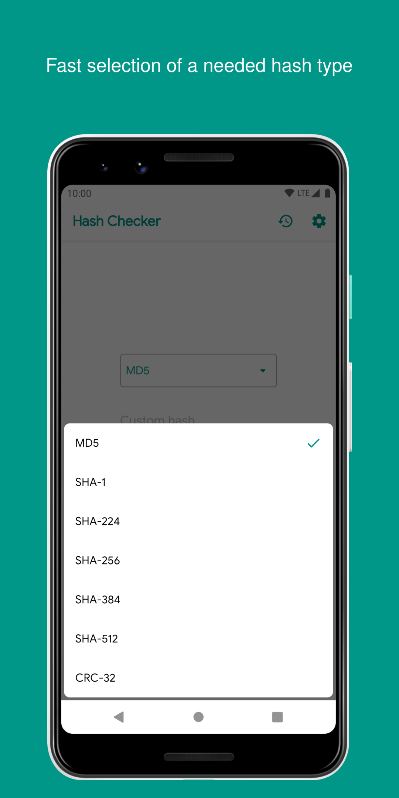
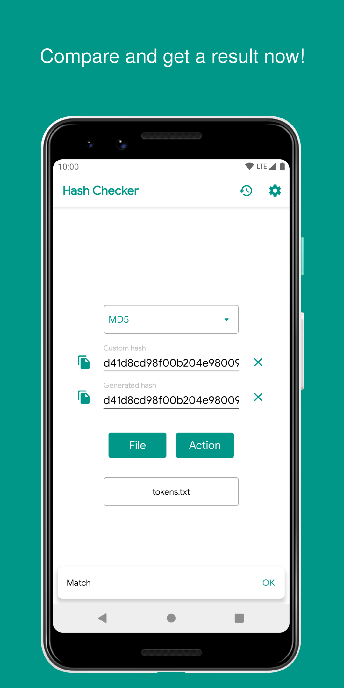
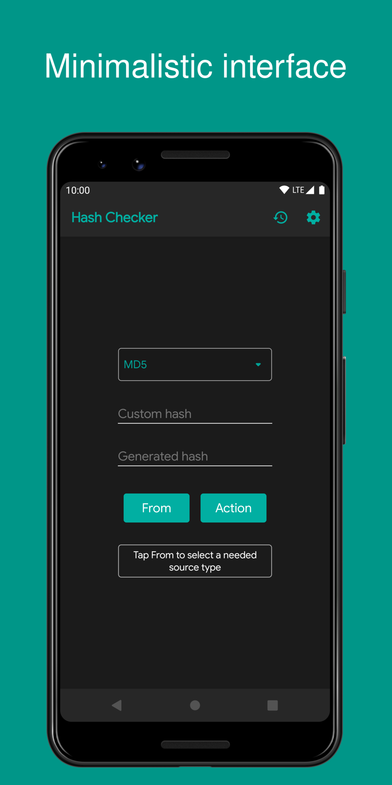
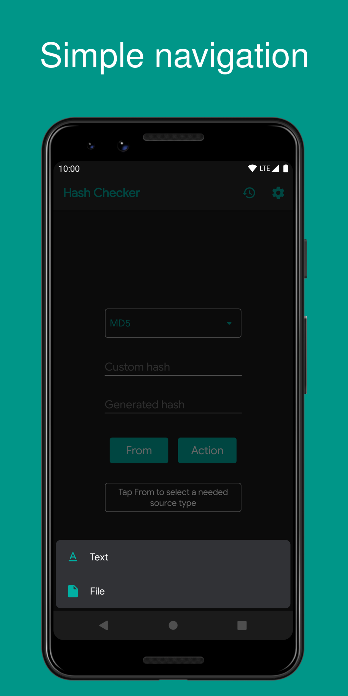
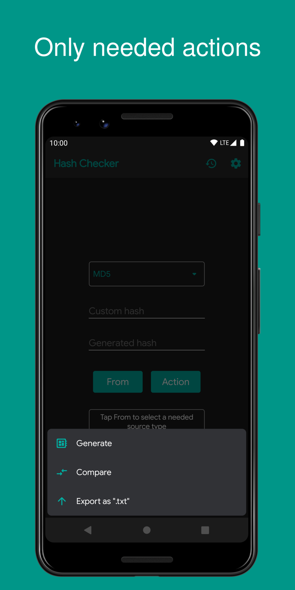
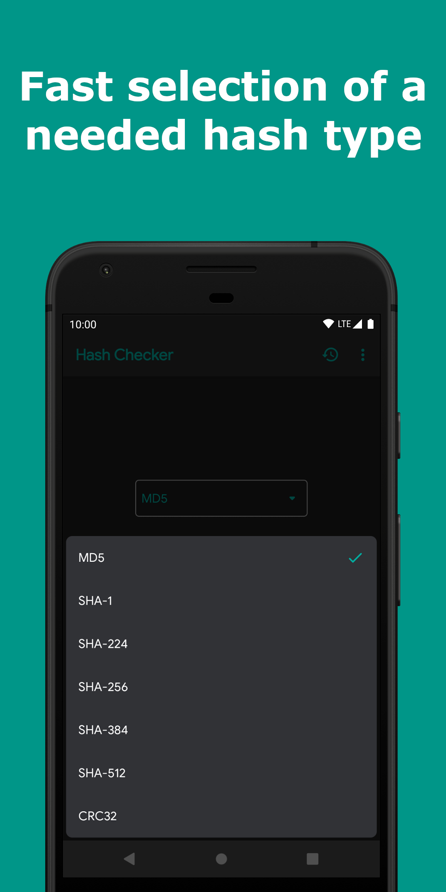
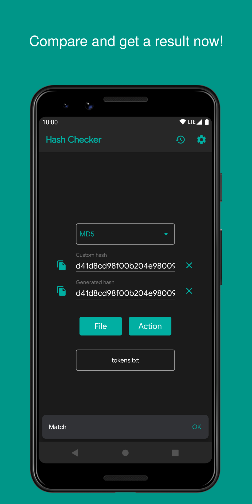

# Hash Checker

[](https://github.com/hash-checker/hash-checker/actions?query=workflow%3ABuild)
[](https://app.codacy.com/gh/hash-checker/hash-checker?utm_source=github.com&utm_medium=referral&utm_content=hash-checker/hash-checker&utm_campaign=Badge_Grade)
[](https://codecov.io/gh/hash-checker/hash-checker)
[](https://github.com/hash-checker/hash-checker/releases)

## Download

<a href="https://github.com/hash-checker/hash-checker/releases">
  
</a>
<a href="https://play.google.com/store/apps/details?id=com.smlnskgmail.jaman.hashchecker">
  
</a>
<a href="https://apt.izzysoft.de/fdroid/index/apk/com.smlnskgmail.jaman.hashchecker.thirdparty">
  
</a>
<a href="https://www.androidfilehost.com/?w=files&flid=316843">
  
</a>

## About application

Fast and simple application that allows you to generate and compare hashes from files and text.

## Supporting algorithms

| Name                                                            | Since version | Status       |
|-----------------------------------------------------------------|---------------|--------------|
| [MD5](https://en.wikipedia.org/wiki/MD5)                        | 1.0.0         | `Supporting` |
| [SHA-1](https://en.wikipedia.org/wiki/SHA-1)                    | 1.0.0         | `Supporting` |
| [SHA-224](https://en.wikipedia.org/wiki/SHA-2)                  | 1.4.0         | `Supporting` |
| [SHA-256](https://en.wikipedia.org/wiki/SHA-2)                  | 1.0.0         | `Supporting` |
| [SHA-384](https://en.wikipedia.org/wiki/SHA-2)                  | 1.4.0         | `Supporting` |
| [SHA-512](https://en.wikipedia.org/wiki/SHA-2)                  | 1.0.0         | `Supporting` |
| [CRC-32](https://en.wikipedia.org/wiki/Cyclic_redundancy_check) | 2.9.0         | `Supporting` |
| [SHA3-224](https://en.wikipedia.org/wiki/SHA-3)                 | 3.6.5         | `Supporting` |
| [SHA3-256](https://en.wikipedia.org/wiki/SHA-3)                 | 3.6.5         | `Supporting` |
| [SHA3-384](https://en.wikipedia.org/wiki/SHA-3)                 | 3.6.5         | `Supporting` |
| [SHA3-512](https://en.wikipedia.org/wiki/SHA-3)                 | 3.6.5         | `Supporting` |

## Screenshots (Light theme)

<br/>
<p align="center">
  
  
  
  
  
</p>

## Screenshots (Dark theme)

<br/>
<p align="center">
  
  
  
  
  
</p>

## Supporting languages

If you want to help with the translation (add a language or update the current one), you can create and
issue [here](https://github.com/hash-checker/hash-checker/issues) or directly download and process languages
from [here](https://github.com/hash-checker/hash-checker/blob/master/app/src/main/res/values/strings.xml) (reference for
English, if you want to work with other language that already exists in app, find it in `values` folder with specific to
your language code (for example, if you want to update Russian locale, it places in `values-ru`).

### Languages in app

| Language           | Since version | Status       |
|--------------------|---------------|--------------|
| English            | 1.0.0         | `Translated` |
| Español            | 2.9.9         | `Translated` |
| Deutsch            | 2.9.6         | `Translated` |
| Français           | 2.9.9         | `Translated` |
| Italiano           | 2.9.9         | `Translated` |
| Magyar             | 2.9.9         | `Translated` |
| Nederlands         | 2.9.9         | `Translated` |
| Norsk              | 3.6.9-1       | `Translated` |
| Svenska            | 2.9.9         | `Translated` |
| Ελληνικά           | 2.9.9         | `Translated` |
| Română             | 3.7.0         | `Translated` |
| Русский            | 2.9.6         | `Translated` |
| Polski             | 2.9.9         | `Translated` |
| Português (Brasil) | 3.7.0         | `Translated` |
| 简体中文               | 2.9.9         | `Translated` |
| 한국어                | 2.9.9         | `Translated` |
| עברית              | 2.9.9         | `Translated` |
| فارسی              | 2.9.9         | `Translated` |
| 日本語                | 3.6.3         | `Translated` |
| Tiếng Việt         | 3.6.5         | `Translated` |
| မြန်မာ             | 3.7.1         | `Translated` |

## How to use

* [H2S Media](https://www.how2shout.com/how-to/how-to-calculate-the-hash-of-a-file-or-create-custom-hash-on-android.html)

## Forums

| Forum                                                     | Language |
|-----------------------------------------------------------|----------|
| [4PDA](https://4pda.to/forum/index.php?showtopic=1015172) | Русский  |

## Videos

* [YouTube](https://www.youtube.com/watch?v=Q7Otn971kJk&list=PLOIwDRWd_SDdBz2aiVtMocFunaXaKSPMx)

## Black Duck Open Hub

* [Hash Checker (Android)](https://www.openhub.net/p/hash-checker)

## Privacy Policy

* [Web version](https://hash-checker.github.io/hash-checker-privacy-policy.io/)

## Feedback

If you have any question or feature idea for this application, you can open an issue
on [this page](https://github.com/hash-checker/hash-checker/issues) or contact me by email
jaman.smlnsk@gmail.com.

## How to contribute

Before commit,
read [Commit Convention](https://github.com/fartem/repository-rules/blob/master/commit-convention/COMMIT_CONVENTION.md)
. Make sure your build is green before you contribute your pull request. Then:

```shell
$ ./gradlew clean
$ ./gradlew build
$ ./gradlew -Pandroid.testInstrumentationRunnerArguments.class=com.smlnskgmail.jaman.hashchecker.AndroidTestSuite connectedCheck
```

If you don't see any error messages, submit your pull request.

## Contributors

<table id='team'>
<tr>
<td id='fartem'>
<a href='https://github.com/fartem'>

</a>
<h4 align='center'><a href='https://github.com/fartem'>Artem Fomchenkov</a></h4>
</td>
<td id='ManishDait'>
<a href='https://github.com/ManishDait'>

</a>
<h4 align='center'><a href='https://github.com/ManishDait'>Manish Dait</a></h4>
</td>
<td id='vipozdn'>
<a href='https://github.com/vipozdn'>

</a>
<h4 align='center'><a href='https://github.com/vipozdn'>Victor</a></h4>
</td>
<td id='Marwa-Eltayeb'>
<a href='https://github.com/Marwa-Eltayeb'>

</a>
<h4 align='center'><a href='https://github.com/Marwa-Eltayeb'>Marwa Said</a></h4>
</td>
<td id='firaja'>
<a href='https://github.com/firaja'>

</a>
<h4 align='center'><a href='https://github.com/firaja'>David Bertoldi</a></h4>
</td>
</tr>
<td id='fu7mu4'>
<a href='https://github.com/fu7mu4'>

</a>
<h4 align='center'><a href='https://github.com/fu7mu4'>fu7mu4</a></h4>
</td>
<td id='AmrDeveloper'>
<a href='https://github.com/AmrDeveloper'>

</a>
<h4 align='center'><a href='https://github.com/AmrDeveloper'>Amr Hesham</a></h4>
</td>
<td id='itamarc'>
<a href='https://github.com/itamarc'>

</a>
<h4 align='center'><a href='https://github.com/itamarc'>Itamar Carvalho</a></h4>
</td>
<td id='StianVaage'>
<a href='https://github.com/StianVaage'>

</a>
<h4 align='center'><a href='https://github.com/StianVaage'>Stian Vaage</a></h4>
</td>
<td id='Alexandru51'>
<a href='https://github.com/Alexandru51'>

</a>
<h4 align='center'><a href='https://github.com/Alexandru51'>Alexandru51</a></h4>
</td>
</tr>
<td id='elliotwutingfeng'>
<a href='https://github.com/elliotwutingfeng'>

</a>
<h4 align='center'><a href='https://github.com/elliotwutingfeng'>Wu Tingfeng</a></h4>
</td>
<td id='Abhisht01'>
<a href='https://github.com/Abhisht01'>

</a>
<h4 align='center'><a href='https://github.com/Abhisht01'>Abhisht Dixit</a></h4>
</td>
<td id='panchal20bhavin'>
<a href='https://github.com/panchal20bhavin'>

</a>
<h4 align='center'><a href='https://github.com/panchal20bhavin'>panchal20bhavin</a></h4>
</td>
<td id='vaqueraexe'>
<a href='https://github.com/vaqueraexe'>

</a>
<h4 align='center'><a href='https://github.com/vaqueraexe'>Sergio Amaya</a></h4>
</td>
</table>

## Special thanks

* [@IzzySoft](https://github.com/IzzySoft) as Izzy for uploading the app
  to [IzzySoft Apt Repositories](https://apt.izzysoft.de)
* [@lexterror](https://github.com/lexterror) as mrrmx for useful feature requests
