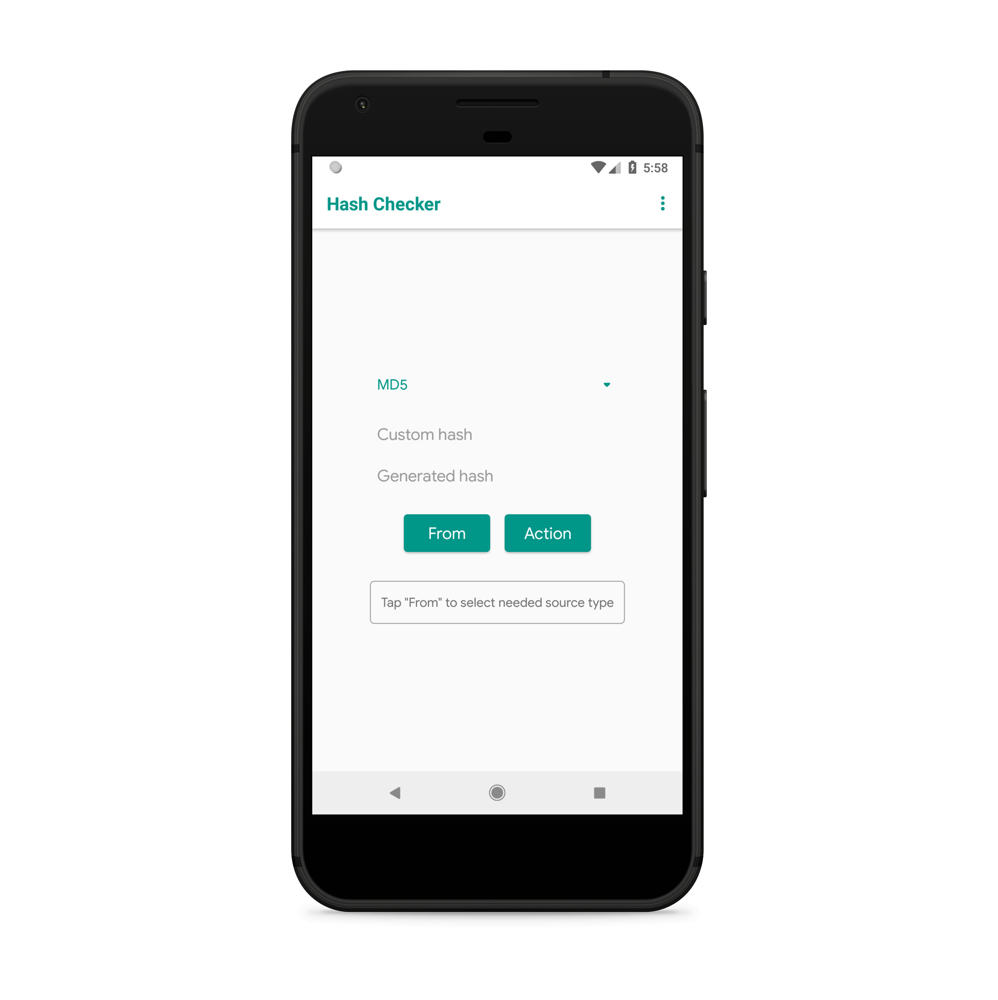
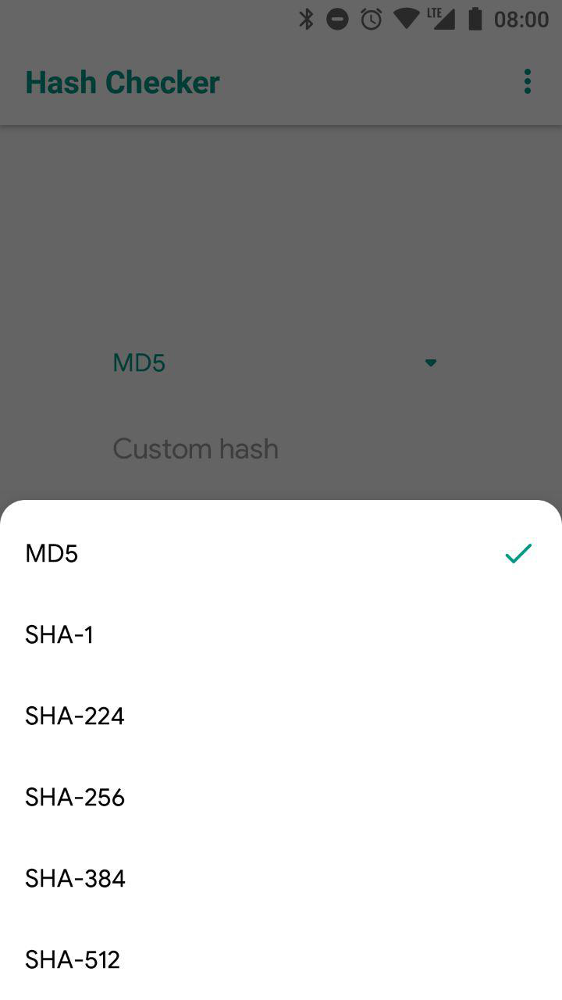
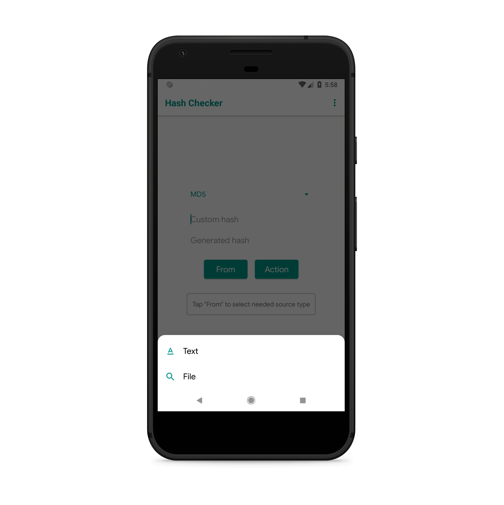
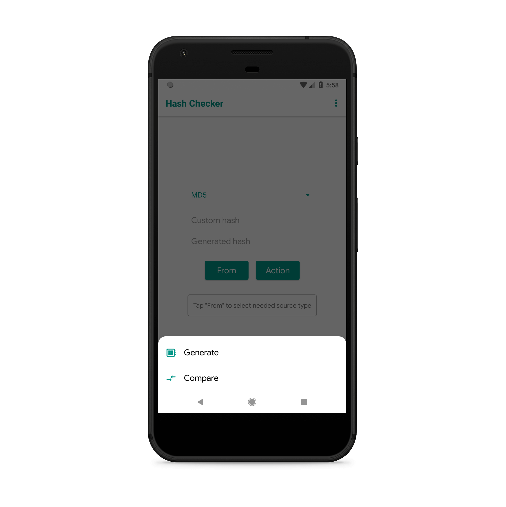

# Hash Checker | [Google Play](https://play.google.com/store/apps/details?id=com.smlnskgmail.jaman.hashchecker)

**Fast and simple application for generate and comparison hashes**

App using [ButterKnife](https://github.com/JakeWharton/butterknife) for UI binding

NOTE: this version does not contain some features of the app from [Google Play](https://play.google.com/store/apps/details?id=com.smlnskgmail.jaman.hashchecker):
 - [Crashlytics](https://fabric.io/home) integration
 - [Author](https://github.com/fartem) info

 

  
  
  
  

